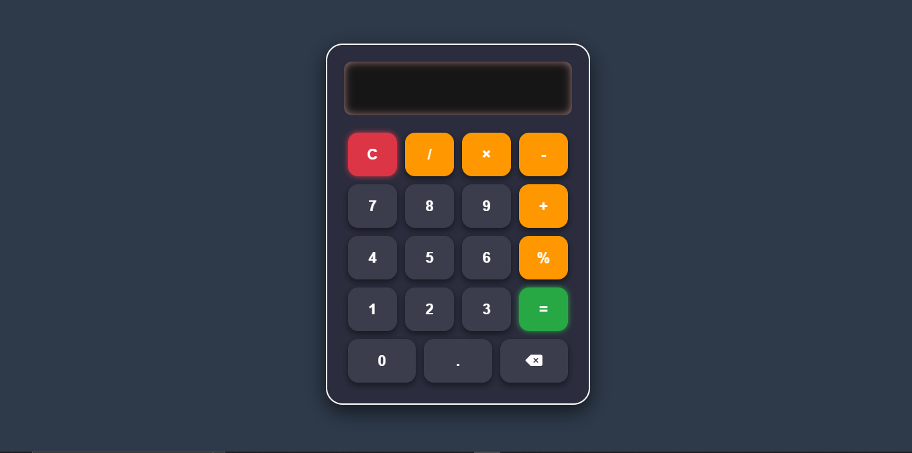

#  Calculator-JS

A simple and modern calculator built using **HTML**, **CSS**, and **JavaScript**.  
This project demonstrates core front-end concepts like **DOM manipulation**, **event handling**, and **responsive UI design**.

---

##  Features
- Perform basic arithmetic operations ➕ ➖ ✖️ ➗
- Supports decimal numbers and percentage calculations
- Clear (C) and backspace (⌫) functionality
- Responsive glassmorphism design
- Smooth hover and click animations

---

##  Technologies Used
- **HTML5** → Structure of the calculator
- **CSS3** → Styling with gradients, shadows, and animations
- **JavaScript (Vanilla JS)** → Logic and DOM interactions
- **Font Awesome** → Icons (delete/backspace symbol)

---

##  User Interface

